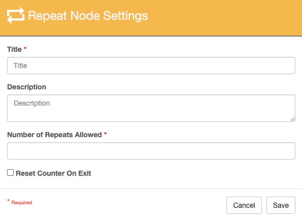
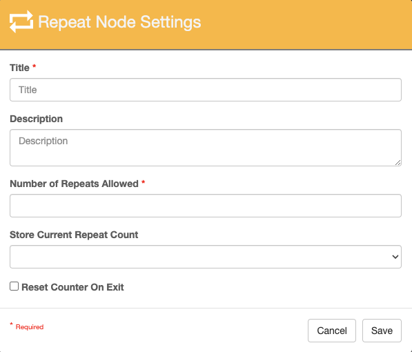
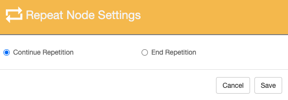
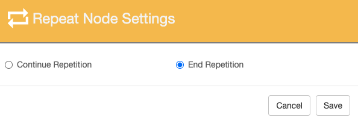
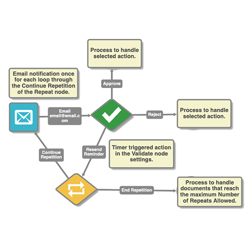

# Repeat Node

!!! info "The Repeat node is a standard GlobalCapture node and is not available in the Solutions Delivery Network.  Upgrading to GlobalCapture 3.1 will add the Repeat node to the Nodes Pane."

{ align=right width="150"}  When documents are moving through capture and/or approval processes they often encounter steps that require repetition.  Some such workflow patterns are working with line-item transactions and table fields, controlling the number of attempts to perform a task, sending out a reminder email, etc.  The Repeat node makes the process of repeating patterns simple.

The Repeat node has two outputs:

- **Continue Repetition** – Path followed when the Repeat Count is less than the Number of Repeats Allowed.

- **End Repetition** - Path followed then the Repeat Count equals the Number of Repeats Allowed.   

## Node Properties

{ align=right width="400" style="border: 2px solid grey;"}
///caption
Repeat Node without Process Fields
///

{ align=right width="400" style="border: 2px solid grey;" }
///caption
Repeat Node with Process Fields
///

**Title**

Add a title for this node. Titles are useful when reading the history in the history of a workflow for easier understanding of the overall process.

**Description**

Provide a synopsis of what this node is doing, or make note of any important details. This is useful for providing additional information such as workflow details and use case information. A good description is helpful when returning to modify the workflow in the future.

**Number of Repeats Allowed**

Enter a numeric value greater than 0.  This is the number of times the repeat will occur before following the End Repetition Path.

!!! Note "Entering a value of zero will always send the process down the End Repetition path with no repeats."

**Reset Counter on Exit**

Resets the Repeat Counter when the document exits the Repeat node via either path.

!!! Warning "This is important to consider if the document can end up back at this node.  If you do not reset the counter, if it returns to this node, it will follow the End Repetition path the first time through as the Repeat Count value will be retained."

## Repeat Count Paths

When a document enters the Repeat node for the first time, the Repeat Counter has a value of 0.  It checks this value against the Number of Repeats Allowed value.  The output will depend on how the value of the Repeat Counter compares to the Number of Repeats Allowed.

{ align=right width="400" style="border: 2px solid grey;"}
///caption
Continue Repetition
///

{ align=right width="400" style="border: 2px solid grey;"}
///caption
End Repetition
///

The **Repeat Counter is increased by 1** and the document will follow the **Continue Repetition** path.   

The **Repeat Count** will not be increased and the document will follow the **End Repetition** path.

## Uses

=== "Daily Reminder"
    **Daily Reminder** - Send out an automated daily reminder of a process awaiting validation. If not acted upon within a certain number of days, escalate the process.

    - Configure the Number of Repeats allow for the number of days you want this to occur before it follows the End Repetition path.

    - Configure an Action in the Validate node with a Timer and connect it back to the Repeat node. Each time the document enters the Validate node, the timer begins counting, if no action is manually taken, it will follow this path back to the Repeat node.
    
    { align=right width="600" }
    ///caption
    Daily Email Reminder
    ///

=== "Email Idle Projects List"
    [Email Idle Projects List](index.md) - Projects without any updates for a certain period of time may be considered at risk. Generate an email report of these projects.
